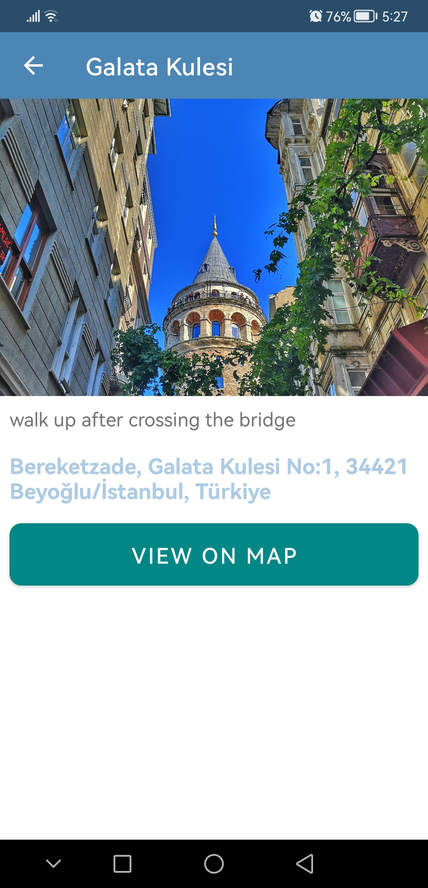
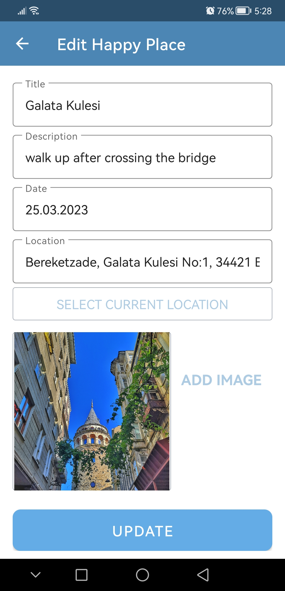
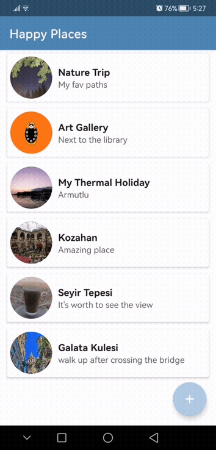

# 📍 HappyPlaces – Location Memory App (Android)

**HappyPlaces** is an Android application that lets users **save, describe, and relive their favorite locations** using maps, custom photos, and notes — even offline.

> “For travelers, explorers, or memory hoarders — keep every happy place pinned forever.”

---

## 🚀 Features

- 🌍 **Google Maps + Places API** for accurate location tagging  
- 🖼 **Image Picker & Camera** support for adding photos  
- 🧠 **Custom Descriptions & Date Picker** to document memories  
- 📡 **Current Location** via FusedLocationProvider  
- 🧠 *Prototype* of **ML Kit-powered place suggestions** (early-stage experiment)  
- 🛠 **Local Storage** using SQLite (Room optional)  
- 🔒 **Dexter Permission Handling** for runtime permissions  
- 💾 **Offline Access** — data saved locally, no login required  

---

## 🧱 Tech Stack

| Layer        | Technology                     |
|--------------|--------------------------------|
| Language     | Kotlin                         |
| UI           | XML layouts                    |
| Location     | Google Places, Maps, GPS APIs  |
| Image Input  | Camera + Gallery               |
| Data         | SQLite (via helper class)      |
| Permissions  | Dexter                         |

---

## 🧪 Screenshots

All screenshots are stored in the `/Screenshots` folder.

  
  
  


---

## 🔧 Setup Instructions

1. Clone this repository  
   ```bash
   git clone https://github.com/Aditya-dev2005/HappyPlaces.git
Open in Android Studio

Add your Google Maps API key to:

app/src/main/res/values/google_maps_api.xml

Sync Gradle and Run


🔮 Future Enhancements : 

✅ Jetpack Compose migration

✅ Cloud sync with Firebase

✅ Multi-image support with carousel

🔄 Further enhance ML Kit-based place suggestions


👤 Author : 

Aditya Chaturvedi

GitHub :  https://github.com/Aditya-dev2005

LinkedIn : https://www.linkedin.com/in/aditya-chaturvedi-8b7776302/
